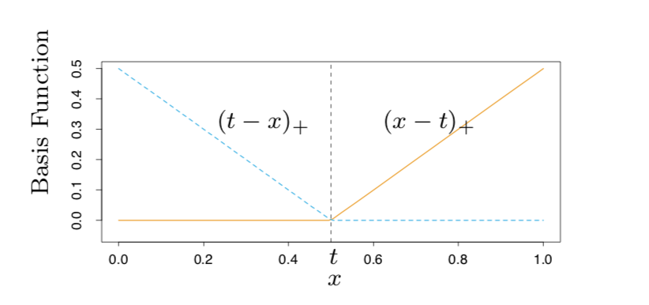

```{r setup, include=FALSE}
knitr::opts_chunk$set(echo = FALSE, include=TRUE)

options(scipen=999)

library(glmnet)
library(gam)
library(e1071)
library(rpart)
library(rpart.plot)
library(randomForest)
library(gbm)
library(earth)
options(java.parameters = "-Xmx12g")
library(rJava)
library(bartMachine)
library(caret)
library(corrplot)
```

```{r Loading Data for Report}
load('data/final_data.RData')
```


## Honor Code

_I have obeyed all rules for this exam and have not received any unauthorized aid or advice_   Signed!

## Overview

My basic approach to this exam was the same as the midterm -- to run all the applicable models that we have used in class and evaluate their performance.  For my analysis, I've chosen _Electricity cooling use (thous Btu)_ (_ELCLBTU_) as the response variable, per the email from Dr. Nateghi.  

_My objective: _

_The local government in the "Pacific" region of the United States would like you to leverage this data and report to them if you can developed a predictive model of the total electricity used for cooling (quantitative response) and identify the main predictors._

With _ELCLBTU_ as the response, the problem becomes a regression problem so I've only chosen those models we've used that are suitable for regression.  They are:  
  
  * Linear Regression
  * Ridge/Lasso Regression
  * GAM
  * Rpart
  * Random Forest/Bagging
  * Boosting
  * Earth
  * BART
  * SVM Regression

## Data Import and Cleaning

The data file has two quite noteworthy characteristics -- more columns than rows and lots of missing values.  My EDA dealt with both and is commented in the attached R Markdown File.  Several key points on the EDA:

  * My assigned area is "Pacific", so I filtered on just "Pacific".  It's possible that using training data from other regions would help our Pacific predicitions, but the Pacific climate is milder than many of the other US regions, so I didn't include the other regions in the training data.  
  * The data included a "Yes/No" question on "Is electricity used for cooling?"  About 12% of the buildings responded in the negative.  After checking to ensure these building had no electricity usage for cooling, I deleted them from the dataframe.   
  * The response, _ELCLBTU_ is not normally distributed, but closer to exponentially distributed.  The log transform was used to bring it in line with a normal distribution.  
  * One outlier (PUBID 5503) was noted in the response data -- one building had usage 25 standard deviations above the mean, while having a square footage only 6 SDs above the mean.  This outlier will dominate the results if left in.  For instance, if the outlier is in the test data and the training data predict the Y value to be equal to the second highest Y value, then the error will be 87M or 100 times the median value.  In comparison, if the second highest Y value is in the test set and the training data predicts it to have the same Y value as the third highest Y value, then the error is 6M or 7 times the median value.  I chose to delete this value, but it should be investigated to find out why it's so high.  If it is a true reading, the cause should be identified and either corrected or, if possible, a predictor added to explain the variation.
  * I removed all the **Z** columns and **FINALWT** columns, as they have no predictive value. 
  * After removing those columns, only 104 columns remained that were without NAs.  As noted in the User's Guide, EIA already tried to impute as many values as they could.  They recommend (p. 16) using the imputed data, which I did.  I also decided to not impute any more data, as (a) it would be error-prone and (b) EIA has already done what they can.  Thus, I deleted all the columns with NAs.  I think we lost some possible valuable data (‘percent exterior glass’ is one example).  
  * I also deleted 12 very low-variance columns.  
  * There are 28 energy usage and expenditure columns.  I deleted these as (a) I feel like including them to predict electrical cooling usage is cheating and (b) if we are trying to predict electrical usage using other usage data, why didn't we just capture the electrical cooling usage data as well?  
  * With the usage columns removed, the correlations with _ELCLBTU_ are not as strong.  The highest correlation with _ELCLBTU_ is 0.66.  Several predictors were highly correlated with each other (> 0.8) and six of these were removed.  Several variables were represented twice (such as "Year Constructed" and "Year Constructed Category").  I elected to keep the most useful one and deleted its twin.
  * Several of the "integer" columns included a "category" or "level" to capture the "greater than" information.  An example is "995" in "Number of Floors" corresponds to greater than 25 floors.  Because 995 is many times larger than 1-25, this variable shouldn't be treated as an integer.  Yet, using it as a factor loses valuable information as _ELCLBTU_ is likely linearly related to the number of floors.  To try and split the difference, I recoded these "995" numbers to more appropriate values and coded these variables as integers.  As confirmation of this technique, step.GAM selected _FLCEILHT_ as a linear variable -- had I kept the "995" it would have had to fit a curve with a sharp bend.  
  
***Note that I've removed the above columns from my dataframe, so my models DO NOT take the whole data file as an input.  I've also deleted one big outlier -- PUBID 5503.  If the models are run with PUBID 5503, the RMSEs will be many times higher.***  

## Models

All analysis was done using a training / test set split of 70/30.  For the linear models, I one-hot encoded the factor variables.  All other models use the non-one-hot encoded dataframe.  To pick parameters for model, I did K-fold CV within the training set.  The test set was only used to evaluate the final model for each model type. The MARS model proved the best of all models and is my final model. The table of results:

```{r Summary Table, include=TRUE}
err.df[order(err.df$`Test RMSE`),]
```


A few notes on the models used:

### Linear Models

The linear regression model had an adjusted $R^2$ of 78%.  A LASSO model was also fitted -- it has a reduced test RMSE and reduces the number of predictors.  The model assumption were also checked and they look good -- the residuals show constant variance and have a close to normal Q-Q Plot.  

```{r Model Assumptions, warning=FALSE, message=FALSE}
par(mfrow=c(1,2))
plot(lm.mod, which=c(1,2))
```


### GAM

A GAM model was run with the available predictors.  Because GAM requires numerics or ordered factors, the number of variables available to use is smaller than the other models.  There are really only 8 integer columns, although I converted several factors to integers by recoding the "995" levels to a appropriate numeric (see above explanation).  With the extra variables, GAM was able to perfrom well, although not the best.  

### SVR

The SVR model was tuned using the _tune()_ over a range of $\epsilon$ and cost.  The best model had $\epsilon=0$ and a cost of 36.   

### Rpart

An rpart model was fit and optimized using _cp_.  The optimal model had eleven terminal nodes.  

### Random Forest

The random forest model was optimized by altering the number of parameters considered at each decision from 10 to all the parameters (bagging) and changing the number of trees.  A 5-fold cross-validation was performed using only the training data set.  The optimal value of _mtry_ was found to be 50, well over the default of $\frac{p}{3}$.  The number of trees with the lowest CV RMSE was 500.  

```{r Plot of RF CV Results}
par(mfrow=c(1,2))
plot(rf.rmse1 ~ DOE.rf1, main="Random Forest MTRY", xlab="# of parameters at each split", ylab="RMSE")
plot(rf.rmse2 ~ DOE.rf2, main="Random Forest #Trees", xlab="# of trees", ylab="RMSE")
```

### Boosting

The Boosting model was optimized by varying the number of trees, interaction depth and shrinkage and checking cross-validation error on the training data set.  The optimum number of trees was small (1000); the optimal interaction depth was 3 and the shrinkage factor was 0.01.  

```{r Boosting CV Optimization Plots}
## Plots to tune hyperparameters
par(mfrow=c(1,3))
plot(boost1.rmse ~ DOE.boost1, main="Interaction Depth", xlab="Interaction Depth", ylab="RMSE")
plot(boost2.rmse ~ DOE.boost2, main="Shrinkage Factor", xlab="Shrinkage Factor", ylab="RMSE")
plot(boost3.rmse ~ DOE.boost3, main="Number of Trees", xlab="Number of Trees", ylab="RMSE")
```

### BART

The BART Model was tuned manually using a 5-fold CV function.  The number of trees and the parameters _k_, _q_ and $\nu$ were all optimized.  The parameters _q_ and $\nu$ were tuned together per the 'default', 'aggresive' and 'conservative' setting listed in the documentation.  Again, a small number of trees were selected by the CV function.  

```{r BART CV Results}
par(mfrow=c(1,3))
plot(bart1.rmse ~ DOE.bart1, main="RMSE w/ BART Model", xlab="Number of Trees", ylab="RMSE")
plot(bart2.rmse ~ DOE.bart2, main="RMSE w/ BART Model", xlab="k", ylab="RMSE")
plot(bart3.rmse ~ DOE.bart3, main="RMSE w/ BART Model", xaxt="n", xlab="Sigma Prior", ylab="RMSE")
axis(1, at = DOE.bart3, labels = c("Default", "Aggressive", "Conservative"), las = 1, cex.axis=0.7)
```

### MARS -- Best Predictive Model

(a) The MARS model was fit using the _earth()_ function.  As described in the above EDA section, a log transform was used on the response variable.  The default pruning method ("backward") was used, although all pruning method were tried.  The default method had the best training error and was selected for use.  

(b) MARS uses hinge functions (see Figure 1 from the ESL book) or products of pairs of hinge functions as basis functions.  A hinge function takes form of zero on one side of a "knot" (0.5 in the Figure 1) and is linear on the opposite side.  Knots are at each observation.  


The model has the form: 

$$f(X) = \beta_0 + \sum_{m=1}^{M}{\beta_mh_m(X)}$$

where $h_m(X)$ is a pair of hinge functions or their products.  The final model specified numerically is:


```{r Final Model Equation}
cat(format(earth.mod), "\n")
```

Plots of these relationships are available as well (Figure 2 below).

Notice that in the equation _CDD65_ has four 'knots', which are visible in the plot.  

(c)  MARS was selected because of its out-of-sample performance and the (relative) ease of inference (see d).  Its runtime is great as well.  

(d)  The most important predictors have been identified by the _earth()_ model.  See table:

```{r Variable Importance}
evimp(earth.mod)
```

When _earth()_ prunes backward from the full model, it counts the number of models in which each variable is present.  That number is in "nsubsets".  Thus, _SQFT_ was in 34 of the models checked during the backward prune.  _SQFT_ is also most important in GCV (similar to LOOCV) and RSS (which measures the RSS drop when a predictor is removed from the model).  Thus, the top-3 most important variables are:  _square footage_, _cooling percentage (of the building)_, and _cooling degree days_.  

## Conclusion

I choose the MARS model because it performed well, runs quickly and is interpretable!  




